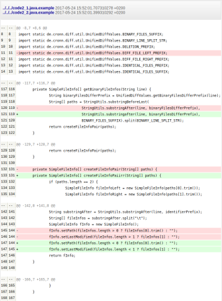
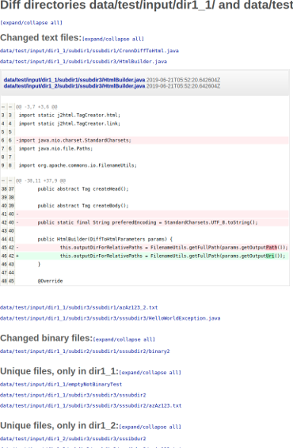

# cronn diff-to-html #

Shows diffs in a convenient html page. 

* Useful when dealing with large validation text files or directory structures in automated builds, e.g. on Jenkins. 
* Collapsible diff sections for each file make the result easy to read when comparing directories
* Pure Java solution (optionally, use Linux diff under the hood - might be faster depending on your machine)

##### Example outputs:
---
 
---

### Usage 


```
$ ./gradlew assemble 
$ java -jar build/libs/cronn-diff-to-html.jar 
usage: cronn-diff-to-html <input_left> <input_right> [<output_html>]  [-w]
       [-b] [-or] [-od] [-iu] [-de] [-u <arg>]
 -w,--ignorewhitespaces   ignore all white spaces
 -b,--ignorespacechange   ignore changes in the amount of white space
 -or,--onlyreports        gives back zero code always
 -od,--osdiff             uses operating system's diff instead of Java
                          implementation and parses the output. Windows
                          not supported currently
 -iu,--ignoreunique       ignore unique files
 -de,--detectencoding     tries to determine encoding type
 -u,--unified <arg>       output <arg> (default 3) lines of unified
                          context
Parsing failed. Reason: Input arguments are missing

$ java -jar build/libs/cronn-diff-to-html.jar dir1_1/ dir1_2/ diff.html

Output written to: file:///home/[DEV]/cronn-diff-to-html/diff.html

Directories differ!

```

Or use the script that wraps the Gradle run task, e.g.: 

```
./cronn-diff-to-html.sh dir1 dir2 diff.html -or
```

### Prerequisites 
- Java 8
- On Unix system (only if you want to use OS diff under the hood)

### Related 
- [java-diff-utils](https://github.com/dnaumenko/java-diff-utils)
- [j2html](https://j2html.com/)
- [System Rules](http://stefanbirkner.github.io/system-rules/)